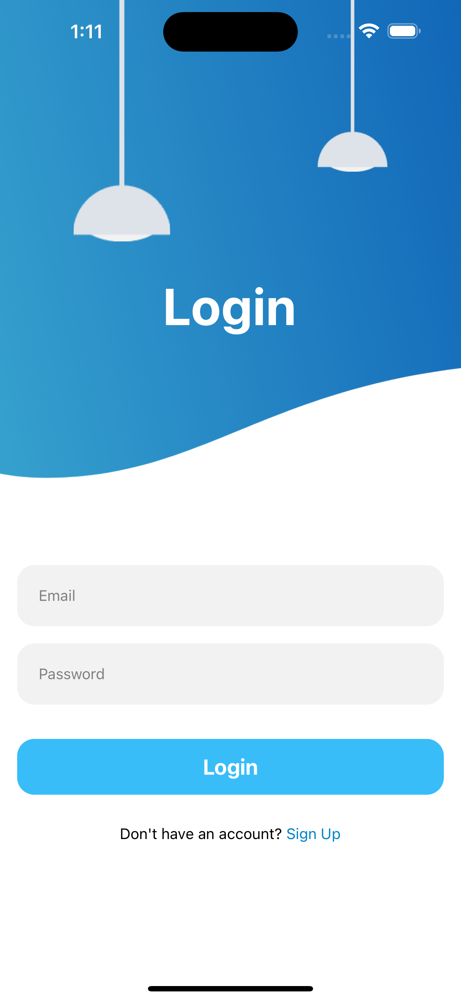
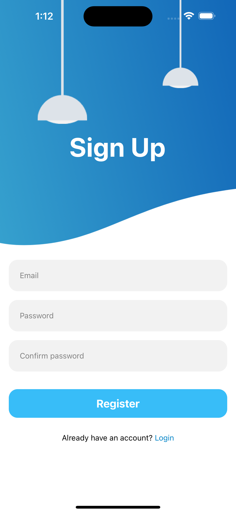

# Auth Screens Animated

  
  

## 🚀 How to use

- Clone `git clone https://github.com/malikdiyaolu/React-Native-Auth-Screens.git`
- Run `yarn` or `npm install`
- Run `yarn start` or `npm run start` to try it out.

## 📝 Notes

- [`react-native-reanimated` docs](https://docs.swmansion.com/react-native-reanimated/)

## Credit

- https://youtu.be/M8u_w6_o584?si=dd3PqfuzR4nY9fA7